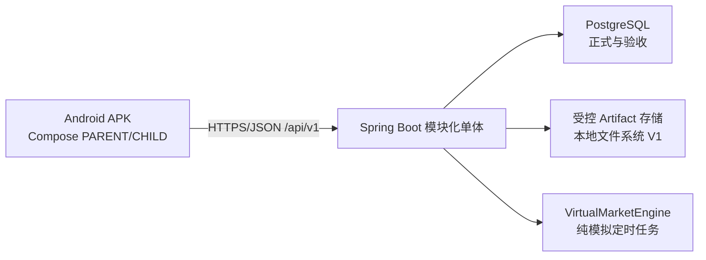

# 02 系统架构

## 总体形态

后端运行在家庭电脑/NAS/开发机，Android 通过局域网访问。开发阶段可用 HTTP，但正式局域网部署必须提供可信 TLS 或明确的配对/证书方案；不允许硬编码服务器地址或 secret。

## 后端模块建议

- `family-growth-domain`：Family、Learning/Growth、UsagePolicy、Reward、Wallet、Saving、Investment 等纯领域模型与规则。
- `family-growth-application`：用例、事务、授权上下文、幂等编排。
- `family-growth-infrastructure`：JPA、Flyway、Artifact、调度、时钟与随机源实现。
- `family-growth-web`：REST DTO、校验、错误映射、认证/CSRF/OpenAPI。
- `family-growth-boot`：Spring Boot 组装与配置。

V1 保持单一部署单元。领域可按包/模块隔离，但不引入网络化微服务。

## Android 分层

- `core:model/network/database/designsystem/security` 提供共用能力。
- `feature:auth/parent/child/growth/wallet/shop/saving/investment/report/settings` 按功能组织。
- ViewModel 只编排 UI 状态；Repository 负责远端/本地策略；金额用字符串或精确十进制模型传递，不转 Double。
- DataStore 存非敏感设置；凭据使用 Android Keystore 加密；Room 仅作缓存/离线草稿，不是金额事实源。
- 平板采用响应式双栏/导航栏布局，以横屏为首要基线；手机窄屏降级为单栏。

## 使用统计与防沉迷架构

Android 在 App 自身生命周期内采集 `UsageSession`：登录角色、开始/结束时间、前台时长、学习任务时长和功能类别。服务端汇总 `DailyUsageSummary` 并根据版本化 `UsagePolicy` 返回剩余可用时长和下一次允许时间。

孩子端在进入受控功能、恢复前台和周期心跳时校验策略；服务端是规则事实源，客户端负责即时拦截。离线时使用最近签名/带版本策略并采取保守限制，重新联网后对账。V1 不申请 Android UsageStats 等跨 App 监控权限，不采集其他应用使用记录。

## API 与一致性

- REST `/api/v1`，JSON 金额用十进制字符串，时间 ISO-8601 UTC。
- 写请求携带身份会话、CSRF（Cookie 方案时）、`Idempotency-Key`；版本敏感操作携带 `If-Match` 或规则版本。
- 统一响应含 `data/error/traceId`；服务端做角色、familyId、childId 对象权限。
- 余额与流水在同一 ACID 事务；事件通知可在事务后发布，不能反向决定账本结果。

## 可观测性与部署

日志使用 traceId 且不记录 PIN、密码、Token、孩子证据原文或图片路径。健康检查区分应用、数据库和存储。V1 提供本地配置模板、Flyway 迁移、备份恢复说明；生产/验收不依赖 H2。
