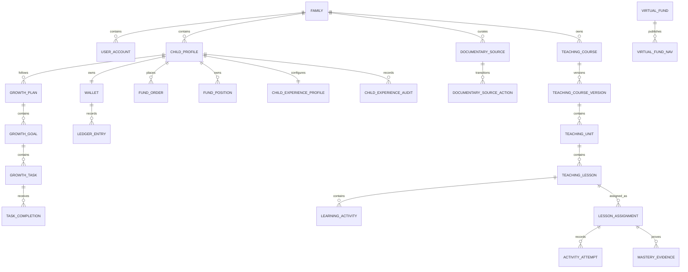

# 03 数据库设计

## 聚合与关系

## V1 表清单

| 领域 | 表 | 核心约束 |
| --- | --- | --- |
| 身份 | `family`, `user_account`, `parent_profile`, `child_profile`, `parent_pin_credential` | family 内用户名唯一；PIN 仅保存哈希 |
| 成长 | `growth_plan`, `growth_goal`, `growth_task`, `task_completion`, `growth_milestone`, `artifact` | 完成提交带状态机与审核人 |
| 学习/使用 | `usage_policy`, `usage_session`, `parent_time_override` | App 内前台/学习时长；规则版本与家长临时放行审计 |
| 奖励 | `reward_rule`, `reward_budget`, `reward_product`, `reward_order` | 规则快照、订单状态机、库存/启用校验 |
| 账本 | `wallet`, `ledger_entry`, `gift_money`, `exchange_rule`, `exchange_order` | wallet 每 child 唯一；Money 总额/冻结额受约束；业务引用唯一；流水追加式 |
| 储蓄 | `saving_account`, `saving_transaction`, `saving_interest_rule`, `wish` | 转入/转出关联 Ledger；利率规则版本化 |
| 投资 | `virtual_fund`, `virtual_fund_nav`, `fund_fee_rule`, `fund_order`, `fund_position` | NAV 日期唯一；订单幂等；持仓唯一 |
| 零钱回收 | `withdrawal_rule`, `withdrawal_quote`, `withdrawal_request`, `withdrawal_action` | 默认 1:1；十分钟报价与费用快照；APPROVED 冻结、PAID 扣账；动作幂等 |
| 学段体验 | `child_experience_profile`, `child_experience_audit` | 每个孩子一份服务端事实源；乐观版本；出生日期/覆盖/触觉变更追加审计 |
| 内容权利目录 | `documentary_source`, `documentary_source_action` | 学段、访问模式、权利依据和到期日必审；DRAFT/APPROVED/WITHDRAWN；动作幂等 |
| 免费教育来源目录 | `education_resource_source`, `_source_stage`, `_category`, `_action` | 公共 HTTPS 来源、适用学段、栏目快照、NEVER/READY/FAILED、DRAFT/APPROVED/WITHDRAWN；刷新失败不删除旧栏目，所有动作幂等 |
| 共用教学引擎 | `teaching_course`, `_version`, `_unit`, `_lesson`, `learning_activity`, `_question`, `_question_option`, `lesson_assignment`, `activity_attempt`, `learning_completion`, `mastery_evidence`, `teaching_action` | 发布版本只读；九类活动固定证据规则；答案键服务端保存；Assignment 乐观版本与动作幂等；V12 在版本上保存幼儿园年龄带和五领域标签；历史证据追加式 |
| 报告 | 优先查询/投影，不建可变余额事实表 | 月报可重算，必要快照在后续 Stage 决定 |

## 数值、ID 与审计

- 主键使用 UUID；外键显式索引，所有家庭域表带 `family_id` 以支持对象权限校验。
- Money `NUMERIC(19,2)`，Coin `BIGINT`，XP `BIGINT`；费率 `NUMERIC(9,6)`；NAV `NUMERIC(19,6)`；份额 `NUMERIC(19,8)`。
- 金额非负约束按业务字段定义；Ledger delta 可正可负。币种 V1 固定 `CNY`，仍保存 `currency_code` 防止语义隐含。
- 所有可变聚合有 `version` 乐观锁、`created_at/updated_at`；业务时间 UTC。
- 订单/奖励执行保存规则快照、费用明细与 `idempotency_key` 唯一约束，避免规则变更重写历史。

## 状态机摘要

- TaskCompletion：`SUBMITTED → APPROVED | REJECTED`，审核结果不可重复发奖。
- RewardOrder：`CREATED → APPROVED | REJECTED | CANCELED → FULFILLED`。
- FundOrder：`PREVIEWED → CONFIRMED → EXECUTED | REJECTED | CANCELED`；预览有短时效和规则版本。
- WithdrawalRequest：`REQUESTED → APPROVED → PAID`；`REQUESTED → REJECTED | CANCELLED`；`APPROVED → CANCELLED`。
- DocumentarySource：`DRAFT → APPROVED → WITHDRAWN`；撤回后不删除历史，孩子目录只查询有效批准项。
- CourseVersion：`DRAFT → PUBLISHED`；发布后没有内容 UPDATE/DELETE API，修改必须创建新版本。
- Kindergarten CourseVersion：V12 的 `kindergarten_age_band` 和 `kindergarten_domains` 随不可变版本保存；发布用例校验每课最多 3 个活动、15 分钟总时长、8 分钟屏幕活动、最多两个选择和至少一个亲子/离屏活动。数据库约束枚举值，领域层负责跨活动聚合规则。
- LessonAssignment：`ASSIGNED → IN_PROGRESS → SUBMITTED → COMPLETED`；`SUBMITTED → REWORK_REQUIRED → IN_PROGRESS → SUBMITTED`，required evidence 不齐或返工后没有新 Attempt 均不得提交；`learning_completion.rework_requested_at` 保留本轮返工边界。

所有建表只能通过新增 Flyway migration；已执行迁移不修改，JPA 使用 `ddl-auto=validate`。
