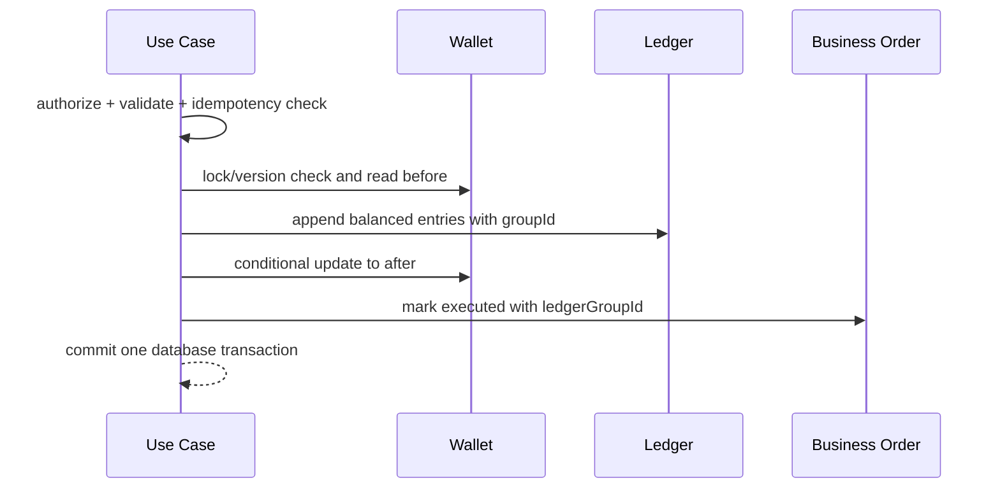

# 04 Wallet + Ledger 设计

## 事实模型

Wallet 保存可快速读取的当前余额：`money_balance`、`reserved_money`、`coin_balance`、`version`；`availableMoney = moneyBalance - reservedMoney`。LedgerEntry 是每次变化的不可变业务事实，至少包含：账户、资产类型、delta、before、after、entryType、业务引用、幂等键、操作者、原因、时间、关联流水组。

XP 属于成长账户，不可兑换，但发放仍需独立可审计记录。Money 与 Coin 不合并计价。

## 原子记账流程

任何一步失败全部回滚。禁止直接 `setBalance`、脱离流水补余额、删除或修改历史流水。纠错通过反向流水和新调账完成。

## 关键场景

| 场景 | 流水 |
| --- | --- |
| 任务奖励 | XP、Coin、Money 分别记录；completionId + rewardType 唯一 |
| GiftMoney | Money `GIFT_MONEY` 入账并关联 giftMoneyId |
| Money→Coin | 同一 group：Money 负数 + Coin 正数；保存买入比例和费用 |
| Coin→Money | 同一 group：Coin 负数 + Money 正数；体现价差 |
| Reward Shop | Coin 扣减建议在订单批准时冻结/扣除；拒绝/取消规则须明确，V1 采用批准时原子扣减 |
| 储蓄 | 可用 Money 与 Saving 子账户之间双边转移，家庭净资产不凭空变化 |
| 基金买卖 | 买入扣 Money 并记录费用/净投入；卖出入 Money 并记录费用/净到账 |
| 零钱回收/提现 | 申请前展示回收比例、固定/比例手续费和预计线下兑现额；APPROVED 只增加 `reserved_money`，PAID 同时减少总额/冻结额并记录 `WITHDRAWAL_PAID`；gross/fee/net 保存在不可变申请快照和流水原因中 |
| 家长调账 | `PARENT_ADJUSTMENT`，强制原因、before/delta/after、操作者 |

## 并发、幂等与对账

- 每个业务动作接受 `Idempotency-Key`，并建立 `(family_id, operation_type, key)` 唯一约束。
- Wallet 用乐观锁/行锁防止超卖；`0 <= reserved_money <= money_balance` 由数据库约束，所有 Money 支出检查 available，余额不得为负（除非未来显式设计信用能力，V1 禁止）。
- 每日对账校验：按资产汇总 Ledger delta 与期初值应等于 Wallet；业务订单必须能追到 ledgerGroupId。
- 费率舍入统一 `HALF_UP` 到分；份额按 8 位，NAV 按 6 位。每种公式在实现 Stage 用测试向量锁定。

## 零钱回收规则

V1 默认 `1.00 Money = ¥1.00`，但家长可以配置家庭内部回收比例。预计线下兑现额为：

`grossPayout = requestedMoney × payoutRate`

`fee = fixedFee + grossPayout × feeRate`

`netPayout = grossPayout - fee`，若净额不大于 0 则拒绝生成报价

这里的“手续费”是家长用于财商教育的家庭规则，不是平台作为真实金融中间商收款。确认页和流水必须分别显示申请 Money、比例、手续费、净兑现额和线下兑现声明；禁止把手续费藏入兑换比例。

## 安全不变量

孩子不能调用调账、费率、预算、批准或 PAID 接口；孩子只能撤销自己的 REQUESTED 申请，APPROVED 的释放由家长执行。所有接口同时校验 family/child 所属。零钱回收提交基于十分钟不可变报价；兑换/基金费用预览与执行之间若规则版本、NAV 或金额变化，执行必须拒绝并要求重新预览。
